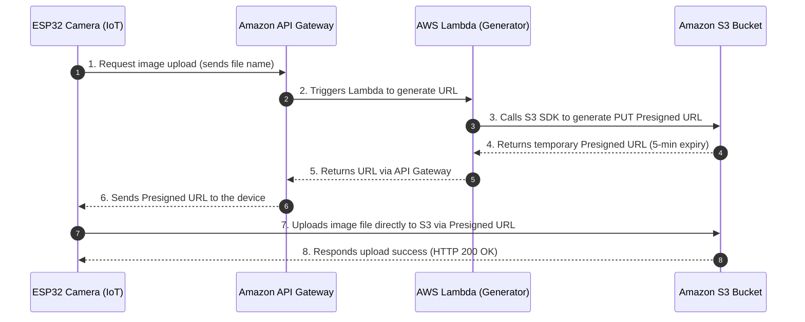

In this section, we will set up the **Amazon S3 Bucket** to store the license plate images captured by the ESP32 Camera, configure **CORS** to support direct uploads, and understand the **S3 Presigned URL** security mechanism.

---

### Step 1: Create an Amazon S3 Bucket
1. Open the **AWS Management Console** and search for the **S3** service.
2. Click **Create bucket**:
   - **Bucket name**: Enter a globally unique name, for example: `smart-parking-plates-storage-xxx` (replace `xxx` with your random string).
   - **AWS Region**: Select the region matching your other AWS resources (recommended: `ap-southeast-1` - Singapore).
   - **Object Ownership**: Select **ACLs disabled (recommended)** to manage access rights using IAM Policies.
   - **Block Public Access settings for this bucket**: Keep **Block all public access** checked.
3. Click **Create bucket** at the bottom of the page to complete the creation.


*(Proof: Screenshot of successful S3 Bucket creation showing the bucket in Private status)*

---

### Step 2: Configure CORS (Cross-Origin Resource Sharing) for S3
Since the web dashboard frontend and the hardware device (ESP32) will send direct requests (HTTP PUT) to the S3 Bucket from different origins, we need to configure CORS on S3 to authorize these upload streams.

1. Click on the name of the newly created S3 Bucket.
2. Switch to the **Permissions** tab and scroll to the bottom to the **Cross-origin resource sharing (CORS)** section.
3. Click **Edit** and paste the following JSON configuration:
   ```json
   [
     {
       "AllowedHeaders": [
         "*"
       ],
       "AllowedMethods": [
         "PUT",
         "POST",
         "GET"
       ],
       "AllowedOrigins": [
         "*"
       ],
       "ExposeHeaders": []
     }
   ]
   ```
4. Click **Save changes** to store the settings.


*(Proof: Screenshot of CORS configuration settings under S3 Bucket Permissions)*

---

### Step 3: Understand the S3 Presigned URL Security Mechanism

#### 1. What is an S3 Presigned URL?
By default, all objects (images) in our S3 Bucket are private. The ESP32 Camera needs AWS credentials (Access Key & Secret Key) to upload images to S3. However, storing these Keys directly on the ESP32 microcontroller is extremely risky.

An **S3 Presigned URL** completely solves this security vulnerability. It is a temporary URL generated and signed by the Serverless backend using AWS IAM credentials, allowing anyone with the URL to upload (PUT) or view (GET) objects **without AWS login credentials**. The URL **automatically expires** after a preconfigured duration (e.g., 5 minutes).

#### 2. Workflow:


In the subsequent sections of the Workshop, we will write Lambda code to generate this URL, and ESP32 code to receive the URL and perform the image upload.
