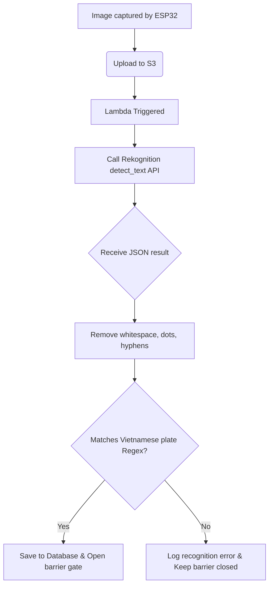

In the smart parking system, **Amazon Rekognition** serves as the primary computer vision recognition engine, responsible for automatically extracting license plate characters from raw images captured by the ESP32 Camera.

---

### 1. Service Overview and Rationale
**Amazon Rekognition** is a fully managed AI and Deep Learning-based image and video analysis service provided by AWS. The system integrates Rekognition's **Text Detection** (OCR) capability due to the following advantages:
- **Resource optimization**: Eliminates the need to build, train, or deploy custom AI license plate recognition models (such as YOLO or self-trained OCR) on EC2 virtual servers, significantly reducing infrastructure costs and maintenance effort.
- **Auto-scaling capability**: The service operates as a Serverless API, automatically handling anywhere from a few images to thousands of vehicle photos submitted simultaneously without causing system bottlenecks.
- **High accuracy**: Amazon's deep learning algorithms can accurately recognize text under various shooting angles, low-light conditions, or glare from vehicle headlights.

---

### 2. API Integration Method and Data Structure
The recognition process is performed by calling the `detect_text` API through the AWS SDK for Python (`boto3`).

#### API call syntax in the Lambda source code:
```python
response = rekognition_client.detect_text(
    Image={
        'S3Object': {
            'Bucket': 'smart-parking-images-075647413376-ap-southeast-1-an',
            'Name': 'parking/in/car_image_123.jpg'
        }
    }
)
```

#### Response structure from Amazon Rekognition (JSON Response):
Upon receiving a request, Amazon Rekognition returns a list of detected text elements along with their bounding box coordinates and confidence scores (percentage). Below is an example of the response data structure:

```json
{
  "TextDetections": [
    {
      "DetectedText": "30F-999.99",
      "Type": "LINE",
      "Id": 0,
      "Confidence": 99.45680236816406,
      "Geometry": {
        "BoundingBox": {
          "Width": 0.254,
          "Height": 0.082,
          "Left": 0.352,
          "Top": 0.451
        }
      }
    },
    {
      "DetectedText": "30F",
      "Type": "WORD",
      "Id": 1,
      "ParentId": 0,
      "Confidence": 99.21400451660156,
      "Geometry": { ... }
    },
    {
      "DetectedText": "99999",
      "Type": "WORD",
      "Id": 2,
      "ParentId": 0,
      "Confidence": 99.69960021972656,
      "Geometry": { ... }
    }
  ]
}
```

---

### 3. License Plate Filtering and Normalization Process
After receiving results from Amazon Rekognition, the Lambda function applies a filtering process to normalize the character string and remove noise (such as vehicle brand names or advertising text around the parking lot):
1. **Remove separator characters**: Strip all whitespace, hyphens (`-`), and dots (`.`) to produce a continuous character string (e.g., `30F-999.99` becomes `30F99999`).
2. **Regular expression (Regex) matching**: Compare the character string against the standard regex pattern for Vietnamese license plates.
3. **Result determination**: If the format matches, the license plate is officially confirmed and forwarded to the DynamoDB storage step.

Recognition data processing flowchart:


