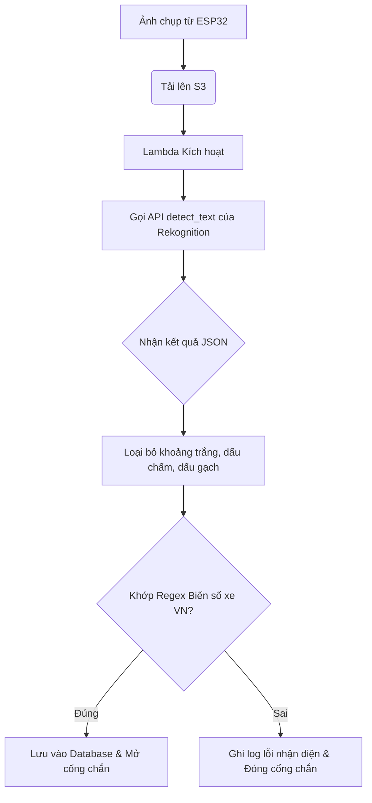

Trong hệ thống đỗ xe thông minh, dịch vụ **Amazon Rekognition** đóng vai trò là động cơ nhận diện thị giác máy tính chính, chịu trách nhiệm tự động trích xuất ký tự biển số xe từ hình ảnh thô được chụp bởi ESP32 Camera.

---

### 1. Giới thiệu dịch vụ và Lý do lựa chọn
**Amazon Rekognition** là dịch vụ phân tích hình ảnh và video dựa trên trí tuệ nhân tạo (AI) và học sâu (Deep Learning) được AWS quản lý hoàn toàn (Managed Service). Hệ thống tích hợp tính năng **Text Detection** (Nhận diện chữ viết - OCR) của dịch vụ này vì những ưu điểm vượt trội:
- **Tối ưu hóa tài nguyên**: Không cần xây dựng, huấn luyện hoặc triển khai các mô hình AI nhận diện biển số xe (như YOLO hay OCR tự huấn luyện) trên các máy chủ ảo EC2, giúp giảm thiểu tối đa chi phí hạ tầng và công sức bảo trì.
- **Khả năng co giãn tự động (Auto-scaling)**: Dịch vụ xử lý dưới dạng API Serverless, tự động đáp ứng từ một vài ảnh đến hàng ngàn ảnh chụp xe gửi về cùng lúc mà không gây nghẽn hệ thống.
- **Độ chính xác cao**: Thuật toán học sâu của Amazon có khả năng nhận diện chữ viết chính xác cao dưới nhiều góc chụp khác nhau, điều kiện ánh sáng yếu hoặc bị lóa sáng do đèn xe.

---

### 2. Phương thức Tích hợp API và Cấu trúc Dữ liệu
Tiến trình nhận diện được thực hiện bằng cách gọi hàm API `detect_text` thông qua thư viện AWS SDK cho Python (`boto3`). 

#### Cú pháp gọi API trong mã nguồn Lambda:
```python
response = rekognition_client.detect_text(
    Image={
        'S3Object': {
            'Bucket': 'smart-parking-images-075647413376-ap-southeast-1-an',
            'Name': 'parking/in/car_image_123.jpg'
        }
    }
)
```

#### Cấu trúc kết quả trả về từ Amazon Rekognition (JSON Response):
Khi nhận yêu cầu, Amazon Rekognition trả về một danh sách các phần tử chữ viết nhận diện được kèm theo tọa độ khung giới hạn (Bounding Box) và độ tin cậy phần trăm (Confidence Score). Dưới đây là ví dụ cấu trúc dữ liệu trả về:

```json
{
  "TextDetections": [
    {
      "DetectedText": "30F-999.99",
      "Type": "LINE",
      "Id": 0,
      "Confidence": 99.45680236816406,
      "Geometry": {
        "BoundingBox": {
          "Width": 0.254,
          "Height": 0.082,
          "Left": 0.352,
          "Top": 0.451
        }
      }
    },
    {
      "DetectedText": "30F",
      "Type": "WORD",
      "Id": 1,
      "ParentId": 0,
      "Confidence": 99.21400451660156,
      "Geometry": { ... }
    },
    {
      "DetectedText": "99999",
      "Type": "WORD",
      "Id": 2,
      "ParentId": 0,
      "Confidence": 99.69960021972656,
      "Geometry": { ... }
    }
  ]
}
```

---

### 3. Quy trình lọc và chuẩn hóa biển số xe
Sau khi nhận kết quả từ Amazon Rekognition, hàm Lambda thực hiện bộ lọc để chuẩn hóa chuỗi ký tự nhằm loại bỏ các thông tin nhiễu (như nhãn hiệu xe, chữ quảng cáo xung quanh bãi đỗ):
1. **Loại bỏ ký tự phân tách**: Loại bỏ toàn bộ khoảng trắng, dấu gạch ngang (`-`), dấu chấm (`.`) để đưa chuỗi ký tự về dạng liền mạch (Ví dụ: `30F-999.99` chuyển thành `30F99999`).
2. **Khớp biểu thức chính quy (Regex)**: So sánh chuỗi ký tự với biểu thức chính quy chuẩn của biển số xe Việt Nam.
3. **Quyết định kết quả**: Nếu khớp định dạng, biển số xe chính thức được công nhận và chuyển tiếp sang bước lưu trữ DynamoDB.

Sơ đồ quy trình xử lý dữ liệu nhận diện:


